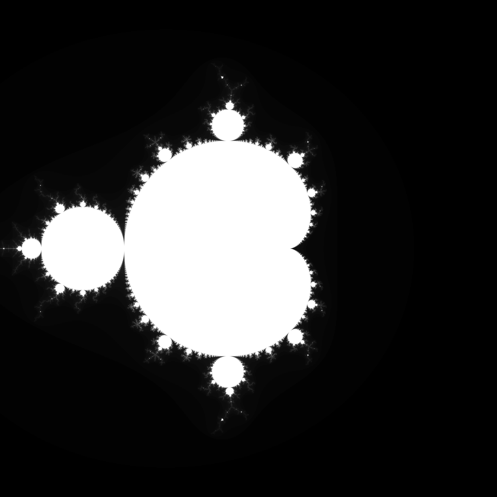
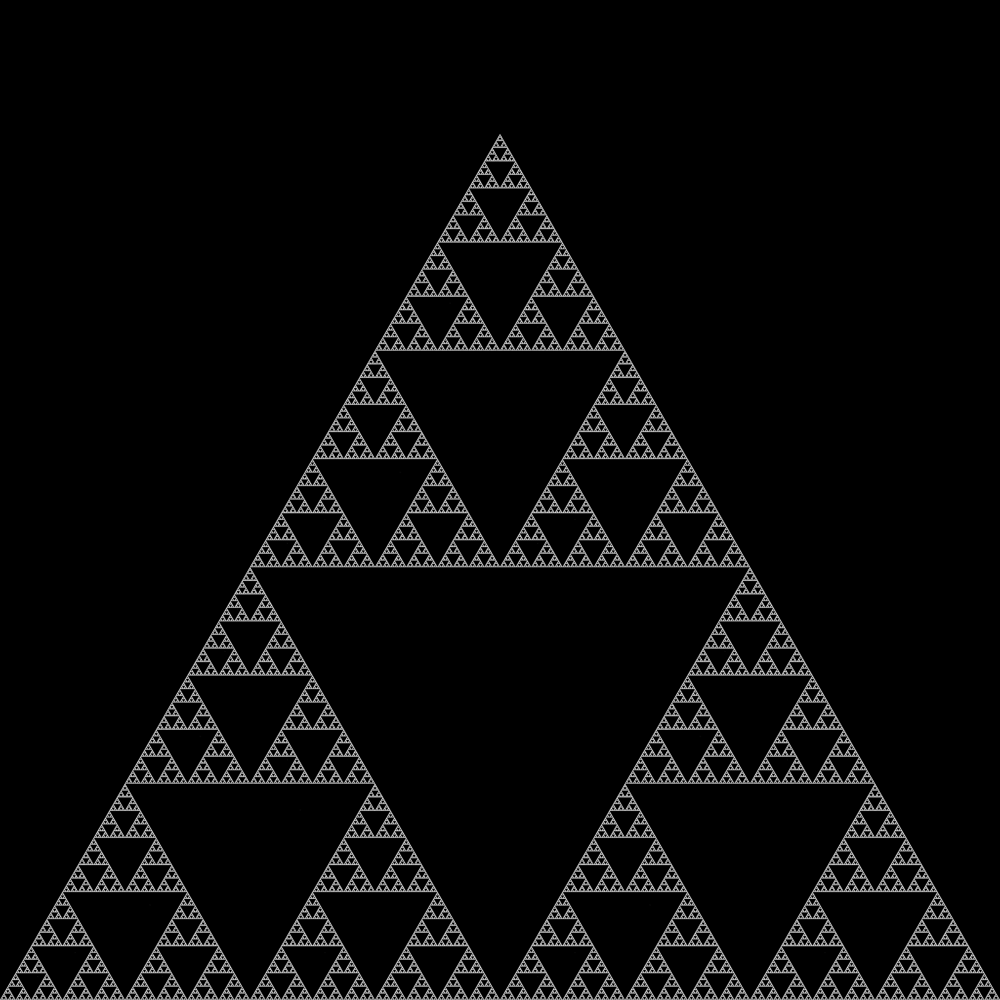
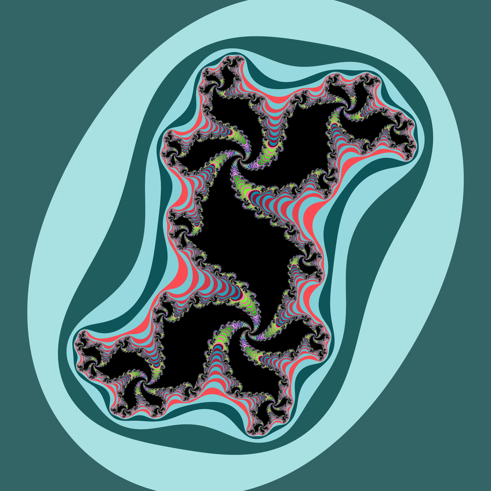
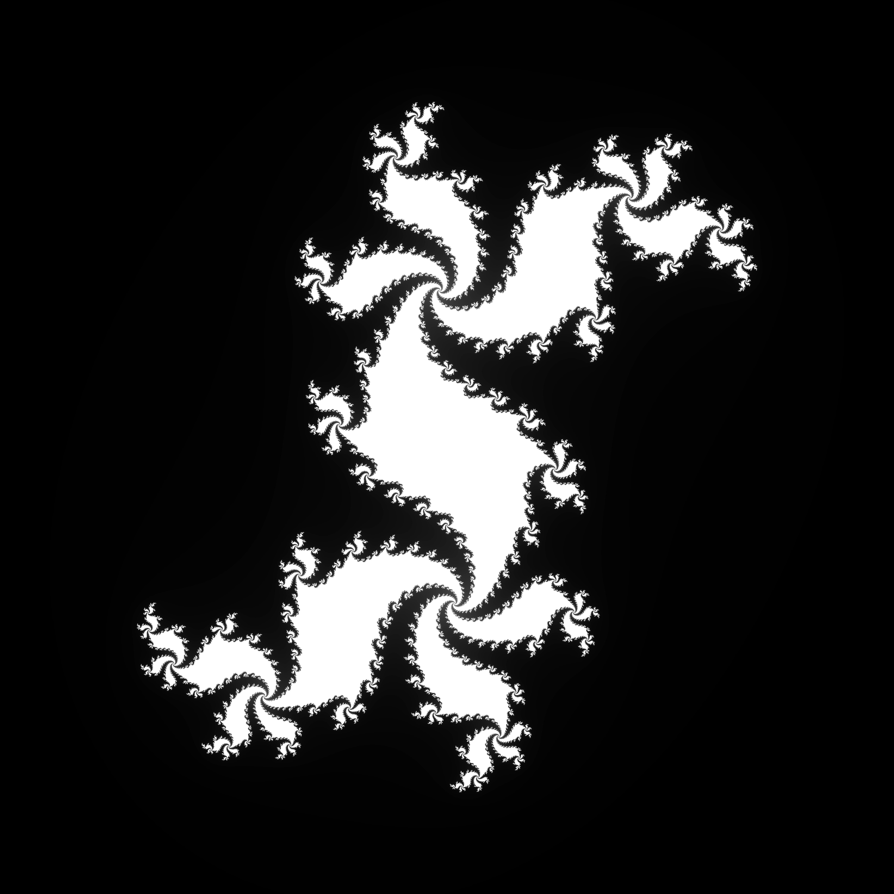

# Fractcli

Simple CLI tool to build fractals image

Possibles flags: 
```
Usage of ./fractcli:
  -colorized
        If the output should be colorized (not possible for sierpinski ATM) (default true)
  -im float
        Imaginary part of the complex number for julia's set computation (default 0.0013)
  -limit int
        Limit of iteration to consider the sequence is bounded (default 200)
  -name string
        Fractal Name, possible options are: [mandelbrot sierpinski julia] (default "mandelbrot")
  -output string
        Name of the image file to output, format should be jpeg (default "myfractal.jpg")
  -re float
        Real part of the complex number for julia's set computation (default 0.285)
  -size int
        Size of the fractal image in px (default 400)

```

## Possible fractals

### Mandelbrot's Set
For example, `./fractcli --output=mandelbrot.jpg --size=6000` outputs


## Sierpinski's fractal
`./fractcli --name=sierpinski --output=sierpinski.jpg --size=6000` outputs


## Julia's set for c=0.3+0.5*i
`./fractcli -name=julia --re=0.3 --im=0.5 --output=julia.jpg --size=6000 --colorized` outputs



And`./fractcli -name=julia --re=0.3 --im=0.5 --output=julia.jpg --size=6000` outputs


### TODO

- Add Koch Snowflake
- Add newton fractals